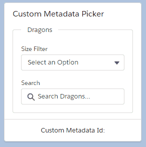

# lwc-metadata-picker

A Custom Metadata Lookup field that allows to filter by a picklist.

## Demo



## Usage

```html
<!-- Parent.html -->
<lightning-card title="Custom Metadata Picker">
  <div class="slds-p-horizontal_medium">
    <fieldset class="slds-box" >
      <legend class="slds-p-horizontal_small slds-text-color_weak" >Dragons</legend>

      <c-metadata-finder
        combo-label="Size Filter"
        picker-label="Search"
        icon-name="utility:setup"
        placeholder="Search Dragons..."
        mdt-name="Dragon__mdt"
        title="MasterLabel"
        subtitle="Size__c"
        filter-by="Size__c"
        onselected={handleMdtSelected}></c-metadata-finder>
    </fieldset>
  </div>

  <div slot="footer">
    Custom Metadata Id: {mdtId}
  </div>
</lightning-card>
```

```javascript
// Parent.js
import { LightningElement, track } from 'lwc'

export default class WipContainer extends LightningElement {
  @track mdtId

  handleMdtSelected (event) {
    this.mdtId = event.detail
  }
}
```

## API Documentation

**Name**|**Type**|**Description**
-----|-----|-----
combo-label|@api prop|Label for the Filter Combobox
picker-label|@api prop|Label for the Search Input
icon-name|@api prop|Icon for records and results
placeholder|@api prop|Placeholder text for the Search Input
mdt-name|@api prop|Custom Metadata API Name
title|@api prop|Custom Metadata Field displayed in Search Results Title
subtitle|@api prop|Custom Metadata Field display in Search Results Subtitle
filter-by|@api prop|Custom Metadata Field to Filter by, defaults to subtitle
onselected|event|Fired when a Metadata Record is selected. event.detail is the metadata record id.

